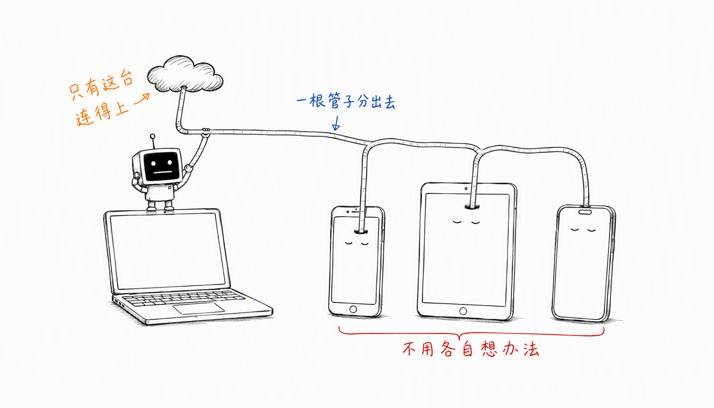
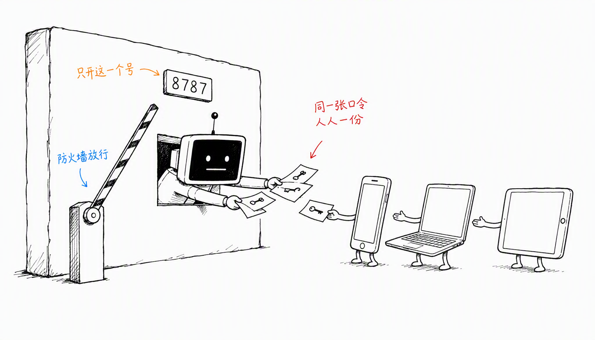
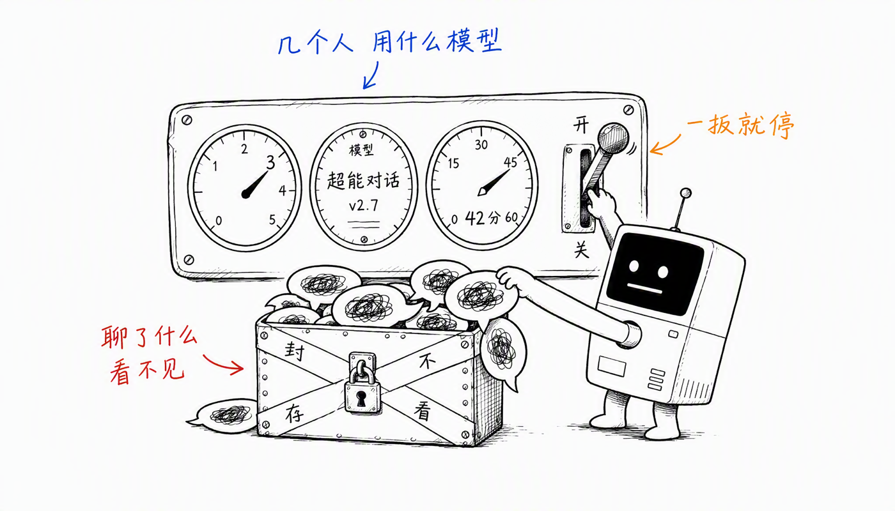

# agent-session-proxy

把**你这台机器上已经装好、也已经登录好**的 coding agent（`qodercli` / `codex`），变成局域网里一个人人能打开的网页聊天页。

小伙伴那边**不用装 CLI、不用登录账号、不用自己搞定网络**——他们只要跟你在同一个 Wi-Fi 下，打开一个链接、输入一个口令，就能在浏览器里跟你的 agent 连续对话，还能传文件、贴截图、点链接把 agent 做好的文件下载走。



零依赖，只要 Node.js ≥ 18。

---

## 这到底在解决什么问题

用大白话讲：

- 你的电脑上，`qodercli`（或 `codex`）已经能跑了。**能力在你这台机器上。**
- 你旁边的同事、同学、朋友，机器上什么都没有。让每个人都装一遍、登录一遍、各自把网络问题解决一遍，成本高得离谱。
- 这个服务做的事，就是**把你这一份能力开个窗口共享出去**：你启动一次，他们用浏览器进来。

所有请求都在你的机器上执行，用的是你的 CLI、你的账号、你的网络。他们的设备只负责显示网页。

**关于 Claude Code：** 目前内置的 backend 只有 `qodercli` 和 `codex` 两个。架构上加一个 CLI 就是在 `lib/backends/` 里再写一个类（见[工作原理](#工作原理)），Claude Code 的 `--output-format stream-json` 协议跟 qodercli 很接近，但**还没有实现，别照着 README 就以为能用**。

### 什么时候适合用

- 一屋子人临时要用同一个 agent 干活
- 演示 / 分享会 / 内部培训，想让别人上手试，但不想让每个人先折腾半小时环境
- 你自己想在手机、平板上接着用电脑上的 agent

### 什么时候不要用

- 不可信的网络（咖啡馆、机场、公共 Wi-Fi）。**拿到口令的人可以在你的机器上读写文件、执行命令。**
- 想暴露到公网。没有 HTTPS，口令和对话都是明文。真要跨网段，自己在前面套一层反向代理 + TLS。

---

## ⚠️ 先读这段

这不是一个只读的聊天代理。**拿到口令的人可以让 agent 在你选的目录里读写文件、执行命令。**

- 两个 CLI 的默认权限模式都是「无人值守」档：qodercli 是 `bypass_permissions`，codex 是 `auto_approve`。想更保守就在页面上换（见[权限模式](#两个-provider-的区别)）。
- **工作目录决定爆炸半径。** 默认落在 `shared_workspace/`，别一上来就改成 `$HOME` 或某个生产仓库。
- **口令是唯一防线。** 别用 `--no-auth`，除非那是一个你完全信任的隔离网络。
- **会话是共享的。** 拿到口令的人能打开任何一个会话、看到里面完整的对话记录。这是「多人协作同一个会话」的设计前提，不是 bug——但意味着**你自己的会话也在同一个池子里**。想聊点别的，换个不共享的地方聊。
- **codex 没有交互式审批**：它每轮起一个进程，没有可以回答「允许 / 拒绝」的通道，权限完全由沙箱策略决定。需要人工确认就用 qodercli 的 `default` 模式。

---

## 五分钟跑起来

### 第 0 步：先确认你的 agent 自己是好的

这一步别跳。如果 CLI 自己都跑不通，代理只会把同一个错误转发给所有人。

```bash
qodercli --version     # 或者
codex --version
```

然后**真的跟它聊一句**，确认账号是登录状态、模型能出字。只装了一个也没关系：缺的那个会在网页下拉框里灰掉并标注「未安装」，选不中。

### 第 1 步：拿到代码

```bash
git clone https://github.com/okcd00/agent-session-proxy.git
cd agent-session-proxy
```

没有依赖要装，`npm install` 也不用跑。

### 第 2 步：启动

```bash
./start.sh 我自己定的口令
```

口令由你定。几种给法：

```bash
./start.sh                       # 不给 → 用 config.json 里的；第一次跑就现场生成一个随机的存进去
./start.sh 我自己定的口令           # 命令行给
./start.sh 我自己定的口令 -p 9000   # 口令 + 其它参数照原样透传给 server.js
ASP_TOKEN=xxx ./start.sh         # 环境变量给，不会出现在 ps 里
ASP_ADMIN_TOKEN=yyy ./start.sh   # 顺手把控制台的管理口令也定下来
```

> 仓库里**没有**内置的兜底口令——写死在公开仓库里的口令等于没有口令。不给就自动生成一个随机串存进 `config.json`，固定不变，不会每次重启都换。

> 命令行传口令会被**同机其它用户**通过 `ps` 看到。介意就用 `ASP_TOKEN`。

启动后长这样：

```
  agent-session-proxy
  workspace : /Users/me/Github/shared_workspace
  qodercli  : qodercli
  codex     : codex
  sessions  : 0 restored, max 8

  → http://127.0.0.1:8787
  → http://192.168.1.15:8787

  passphrase: 我自己定的口令
  share     : http://192.168.1.15:8787/?token=我自己定的口令

  console   : http://127.0.0.1:8787/admin.html?admin=k3Jd9x_QpLm2vT8s
```

四行关键信息：

| 行 | 是什么 | 给谁 |
| --- | --- | --- |
| `→ http://127.0.0.1:8787` | 只有你自己能开 | 你 |
| `→ http://192.168.1.15:8787` | 局域网地址，小伙伴用这个 | 小伙伴 |
| `share` | 局域网地址 + 口令，点开就进 | 小伙伴（最省事） |
| `console` | 控制台，**带的是另一个口令** | 只给你自己 |

> `console` 那一行只会打印在这个终端里，网页上任何地方都不显示。管理口令和分享口令是两把不同的钥匙：**拿到分享口令的人进不了控制台，也关不掉你的服务。**

管理口令的规则和分享口令一样：不指定就生成一个存进 `config.json`，之后固定不变。

也可以直接用底层命令：

```bash
node server.js --token 我自己定的口令
```

### 第 3 步：把链接发给小伙伴

把 `share` 那一行发到群里就行。



**他们那边的操作：**

1. 点开链接 → 直接进去了（口令在链接里，自动存进浏览器，下次打开免输）
2. 或者手动打开 `http://192.168.1.15:8787`，在口令框里粘贴口令
3. 手机上可以「添加到主屏幕」，之后当 App 用
4. 进去以后：点「新建会话」→ 选 CLI / 模型 / 工作目录 → 开始聊。也可以直接进别人已经建好的会话，几个人对着同一条实时流接力

**口令存在浏览器的 localStorage 里。** 换浏览器、无痕窗口、清了数据，就要重新输一次。

### 第 4 步：开放端口

服务默认绑 `0.0.0.0`，也就是「所有网卡都收」，这一步代理已经帮你做了。剩下的是**操作系统防火墙**。

**macOS**

系统自带防火墙默认是关的。如果你开了：

- 第一次有人从外部连进来时，系统会弹窗问「是否允许 node 接受传入连接」，点**允许**
- 弹窗被误点了「拒绝」，去「系统设置 → 网络 → 防火墙 → 选项」里把 `node` 改成允许
- 命令行加白名单：
  ```bash
  sudo /usr/libexec/ApplicationFirewall/socketfilterfw --add "$(which node)"
  sudo /usr/libexec/ApplicationFirewall/socketfilterfw --unblockapp "$(which node)"
  ```

**Windows**

第一次启动会弹「Windows 安全中心警报」，**勾上「专用网络」** 再点允许。手动加规则：

```powershell
New-NetFirewallRule -DisplayName "agent-session-proxy" -Direction Inbound -Protocol TCP -LocalPort 8787 -Action Allow -Profile Private
```

**Linux**

```bash
sudo ufw allow 8787/tcp                      # ufw
sudo firewall-cmd --add-port=8787/tcp        # firewalld（加 --permanent 持久化）
```

**怎么确认真的通了**

只有一个可靠办法：**让小伙伴在他自己的设备上打开那个链接。** 在你自己机器上 `curl` 你自己的 IP 是没用的——那条路径不经过入站过滤，永远会成功，测不出问题。

### 第 5 步：连不上的时候按这个顺序查

1. **两台设备真的在同一个网络里吗？** 手机连的是 5G 不是 Wi-Fi、笔记本连的是手机热点，都很常见。让对方看一眼自己的 IP 前三段，和你的一不一样。
2. **是不是访客网络 / AP 隔离？** 很多路由器和公司 Wi-Fi 默认开「客户端隔离」，同一个 Wi-Fi 下的设备互相看不见。这种情况下端口开了也没用，只能换网络或者让路由器关掉隔离。
3. **IP 变了吗？** DHCP 会换地址。重启一下服务看新打印的那行局域网地址，或者在控制台页面上看实时地址。
4. **VPN 在捣乱吗？** 挂着 VPN 时机器可能有一堆 `utun*` 虚拟网卡。代理会**优先列出物理网卡的地址**，但如果 VPN 把全部流量都劫走了，局域网还是可能不通。试着断开 VPN。
5. **端口被占了？** 启动时会直接报 `port 8787 is already in use`，换 `-p 9000`。
6. **防火墙。** 回到第 4 步。

---

## 控制台：一键开关 + 看谁在线

打开启动时打印的那行 `console` 地址，就是主人专用的控制台。



上面有什么：

| 区块 | 内容 |
| --- | --- |
| **对外共享开关** | 一个按钮，暂停 / 恢复。暂停后小伙伴立刻被断开，再访问会看到「主人暂停了共享」，会话和历史全部保留 |
| **四个数字** | 此刻连入的人数、独立设备数（按 IP 去重）、会话数 / 上限、已运行时长 |
| **把这个发给小伙伴** | 一键链接、纯网址、分享口令（默认打码，可点「显示」），都带复制按钮；还有监听地址和其它可用的局域网地址 |
| **此刻连入的小伙伴** | 每个连接一行：设备类型、来源 IP、在看哪个会话、用的哪个后端和模型、连了多久，右边可以单独「断开」 |
| **会话** | 名称、后端 / 模型、状态、轮数、工作目录、最近活跃；有人正在看的会话会标「N 人在看」 |
| **这台机器** | 两个 CLI 的版本和路径、共享工作目录、运行环境 |
| **关掉服务** | 彻底结束进程 |

### 隐私边界

控制台**只显示连接信息和模型信息，不显示任何一句对话内容**。这不是靠前端藏起来的，是后端就没给：`/api/admin/state` 的响应体是手写的投影，不复用会话快照，所以 `transcript` 和进行中的流式文本根本不在里面。仓库里有测试专门守这条线——`test/admin.test.mjs` 会真的发一条消息，然后断言 admin 接口的响应里搜不到它。

看得到：几个人、哪些设备、来自哪个 IP、在看哪个会话、用什么模型。
看不到：任何人说了什么、agent 回了什么。

> 前面也说过，这里再强调一次：**控制台看不到内容，但聊天页面看得到。** 拿到分享口令的人可以打开任何会话读完整记录。控制台的隐私保证覆盖的是「主人的监控视角」，不是「会话之间互相隔离」。

### 「暂停共享」和「彻底关闭」的区别

| | 暂停共享 | 彻底关闭进程 |
| --- | --- | --- |
| 小伙伴看到 | 「主人暂停了共享」，页面会自己等着恢复 | 页面连不上 |
| 会话和历史 | 全部保留 | 留在 `sessions.json` 和 CLI 自己的历史里，重启后能恢复 |
| 你自己还能用吗 | 能（你的页签带着管理口令就不受限） | 不能，服务没了 |
| 怎么恢复 | 控制台上再点一下 | **必须回到那台机器的终端里跑 `./start.sh`** |
| CLI 子进程 | 继续活着 | 全部关掉 |

一句话：日常想「关掉」，用**暂停共享**；真的要收工，才用**彻底关闭**。

> 为什么没有「一键开启」？因为控制台这个网页本身是这个服务发出来的。服务停了，页面也就没了，没有东西能再把它叫起来。要做到真正的一键开机，得再跑一个常驻守护进程——那是另一个信任面，暂时没做。

### 管理口令怎么定

不指定的话，第一次启动会生成一个 16 字节的随机串，存进 `config.json`，之后固定不变。想自己定：

```bash
ASP_ADMIN_TOKEN=我的管理口令 ./start.sh 我的分享口令
# 或者
node server.js --token 分享口令 --admin-token 管理口令
```

控制台页面会把 URL 里的 `?admin=` 参数**立刻从地址栏抹掉**（改存到 localStorage），免得截图或者分享网址的时候连管理口令一起漏出去。

---

## 共享工作区 `shared_workspace/`

启动时会在**仓库同级目录**创建 `shared_workspace/`，作为新建会话的默认工作目录：

```
Github/
├── agent-session-proxy/     ← 本服务
└── shared_workspace/        ← 默认工作区（自动创建）
    ├── .tmp/                ← 子进程的 TMPDIR / TMP / TEMP
    ├── uploads/             ← 网页上传的附件（首次上传时创建）
    └── README.md            ← 说明标记
```

两个 CLI 都在这个目录下生效，临时文件也写进 `.tmp/`，不会散落到系统 `/tmp` 里。想换地方：`--workspace <dir>`，或在网页「设置」里改 `sharedWorkspace`。已经建过会话的目录不受影响。

---

## 命令行参数

| 参数 | 说明 |
| --- | --- |
| `-p, --port <n>` | 监听端口，默认 `8787` |
| `--host <addr>` | 绑定地址，默认 `0.0.0.0`（局域网可达）。填具体地址就只绑那一个 |
| `--token <secret>` | 固定访问口令（分享给小伙伴的那个） |
| `--admin-token <s>` | 控制台的管理口令，不给就生成一个存进 `config.json` |
| `--no-auth` | 关闭口令校验（不建议）。注意管理口令**依然生效**，不然谁都能关你的服务 |
| `--provider <id>` | 新建会话的默认 CLI：`qodercli`（默认）\| `codex` |
| `--qodercli <path>` | qodercli 可执行文件路径，默认取 `PATH` |
| `--codex <path>` | codex 可执行文件路径，默认取 `PATH` |
| `--workspace <dir>` | 共享工作区路径，默认仓库同级的 `shared_workspace/` |
| `--cwd <dir>` | 新建会话的默认工作目录，默认就是共享工作区 |
| `-m, --model <name>` | 新建会话的默认模型 |
| `--permission-mode <m>` | 权限模式，取值取决于 `--provider`（见下表） |
| `--max-sessions <n>` | 最大并发会话数，默认 8 |

优先级是 **命令行参数 > `config.json` > 内置默认值**。网页里改的设置会写进 `config.json`，但下次启动时如果显式传了同名参数，以参数为准（并且会被写回 `config.json`）。

---

## 两个 provider 的区别

| | **Qoder CLI** | **Codex CLI** |
| --- | --- | --- |
| 进程模型 | 一个常驻进程维持整个会话 | 每轮起一个 `codex exec`，用 thread id 续接 |
| 输出 | 逐 token 流式 | 整段返回（无 token 级流式） |
| 进行中反馈 | 实时文字 + 思考过程 | 活动卡片（正在执行哪条命令 + 输出） |
| 交互式审批 | ✅ 支持，网页上弹卡片 | ❌ 不支持，由沙箱策略决定 |
| Agent / 追加系统提示词 | ✅ | ❌（codex 无对应参数） |
| 图片输入 | base64 图片块内联 | `-i` 参数传路径 |
| 模型来源 | `qodercli --list-models` | `~/.codex/config.toml` 里的 `model_catalog_json` |

**权限模式**

| provider | 取值 |
| --- | --- |
| qodercli | `bypass_permissions`（默认，全部放行）· `dont_ask` · `accept_edits` · `auto` · `default`（危险操作在网页上弹确认） |
| codex | `auto_approve`（默认，工作区可写 + 沙箱内自动批准）· `full_access`（不用沙箱，最危险）· `workspace_write`（需批准，无人值守会被拒）· `read_only` |

---

## 网页上能做什么

**会话**
- 每个会话对应一个独立的 CLI 后端，有自己的 provider、模型、目录、权限模式，上下文互不干扰
- 左侧列表显示状态（启动中 / 空闲 / 运行中 / 已停止 / 出错）和 provider
- 会话是共享的：多个人打开同一个会话会看到同一条实时流，谁都能接着往下说

**对话**
- qodercli 逐 token 流式；codex 用活动卡片显示当前在跑什么命令
- 思考过程和工具调用各自折叠成卡片，入参和返回结果直接展示
- 每回合结束显示耗时和 token 用量
- 「停止」中断当前回合；正在处理时再发消息会自动排队

**附件**
- 三种方式把文件交给 agent：点 📎 选文件、直接**粘贴截图**（Cmd+V）、或把文件**拖进窗口**
- 待发送的附件显示成可删除的小卡片，图片带缩略图；可以只发附件不打字
- 文件落在会话工作目录的 `uploads/` 下，所以 agent 能用自己的工具直接读
- 图片会真正送进模型：qodercli 走 base64 图片块，codex 走 `-i` 参数；超过 8MB 的图片只给路径，让 CLI 自己去读并压缩
- 非图片文件只传路径（两个 CLI 都没有对应的入参），agent 用 Read / shell 打开
- 单个文件 ≤ 20MB，一条消息 ≤ 8 个附件；文件名会被消毒，`../../x.png` 只会得到 `uploads/x.png`
- 切换会话会清空未发送的附件，避免传错目录

**下载**
- agent 输出里的绝对路径会自动变成下载链接（反引号里的也算），点一下就存到本地
- 工具卡片（Write / Edit / Read 等）标题行右侧有「⬇ 下载」，不用展开卡片
- 只能下载**共享工作区和各会话工作目录**里的文件，作用域外一律 403
- 全部以附件形式下载（`Content-Disposition: attachment`），html / svg 这类能在源内执行脚本的类型强制降级成 `application/octet-stream`，避免上传一个网页就把口令偷走

**配置**
- 新建会话时先选 provider，模型列表、权限模式、提示文案都会跟着切换
- 工作目录带目录浏览器，默认指向共享工作区
- 「设置」里改默认值、换口令、改共享工作区、看两个 CLI 的版本和局域网地址

---

## 会话的生命周期

会话不会因为你关掉浏览器而消失，也不会因为代理重启而丢上下文。

**qodercli（常驻进程）**

1. 每个会话对应一个常驻 `qodercli` 进程，多轮上下文由它自己维护
2. 代理把 `id → qodercli session id` 记在 `sessions.json` 里
3. 代理重启后会话以「已停止」状态恢复，**对话记录从 qodercli 自己写的 JSONL 历史里重新加载**
4. 再发消息时自动用 `qodercli -r <session-id>` 拉起进程，模型侧上下文原样接上

「停止进程」可以主动释放内存，之后随时恢复。

**codex（每轮一个进程）**

1. 第一轮 `codex exec` 结束后进程就退出，代理记下 `thread_id`
2. 之后每轮用 `codex exec resume <thread_id>` 续接，上下文由 codex 的 rollout 文件维持
3. 代理重启后从 `~/.codex/sessions/YYYY/MM/DD/rollout-*.jsonl` 重建对话记录
4. 会话在两轮之间总是「无进程」状态，这是正常的，不需要「恢复进程」

---

## HTTP API

### 聊天接口（需要分享口令）

所有 `/api/*`（除 `health`、`auth`）都需要 `Authorization: Bearer <token>`，或者 `x-proxy-token` 头，或者 `?token=` 查询参数。

| 方法 | 路径 | 说明 |
| --- | --- | --- |
| GET | `/api/health` | 存活探测；附带是否需要口令、以及当前是否处于「暂停共享」 |
| POST | `/api/auth` | 校验口令 `{token}` |
| GET | `/api/server` | 版本、主机、局域网地址、各 provider 可用性、工作区 |
| GET | `/api/models?provider=<id>` | 模型列表，`?refresh=1` 强制重查 |
| GET | `/api/config` | 当前默认设置（含 provider 元数据） |
| POST | `/api/config` | 改默认设置 / 换口令 / 改共享工作区 |
| GET | `/api/fs?path=<dir>` | 列目录，给目录浏览器用；省略 `path` 时从工作区开始 |
| GET | `/api/sessions` | 会话列表 |
| POST | `/api/sessions` | 新建会话 `{provider, name, model, cwd, permissionMode, agent, appendSystemPrompt, addDirs, extraArgs}` |
| GET | `/api/sessions/:id` | 会话详情 + 完整对话记录 |
| GET | `/api/sessions/:id/logs` | CLI 子进程日志 |
| POST | `/api/sessions/:id/uploads` | 上传附件 `{files:[{name,mime,dataBase64}]}`，落到该会话工作目录的 `uploads/` |
| POST | `/api/sessions/:id/messages` | 发消息 `{text, attachments:[{name,path,mime,isImage}]}`；`text` 和 `attachments` 至少要有一个 |
| GET | `/api/files?path=<abs>` | 下载文件。作用域限制在工作区与会话目录内；支持 `?token=`，因为 `<a download>` 发不了 Authorization 头 |
| POST | `/api/sessions/:id/interrupt` | 中断当前回合 |
| POST | `/api/sessions/:id/stop` | 停掉进程（保留上下文，可恢复） |
| POST | `/api/sessions/:id/resume` | 重新拉起常驻进程（codex 会话没有常驻进程，只清除「已停止」标记） |
| DELETE | `/api/sessions/:id` | 删除会话 |
| POST | `/api/sessions/:id/permissions/:requestId` | 应答权限请求 `{allow}`；codex 会话返回 409 |
| POST | `/api/presence` | 上报「我在看哪个会话」`{viewerId, sessionId}`。只有 id，给控制台统计用 |
| GET | `/api/stream` | SSE 全局事件流 |

暂停共享期间，上表除 `health` / `auth` 之外都返回 `503 {error:"sharing paused", sharing:false}`。

### 控制台接口（需要管理口令）

`/api/admin/*` 只认 `x-admin-token` 头或 `?admin=` 查询参数。**分享口令在这里一律 401**，反过来管理口令也进不了上面的聊天接口。

| 方法 | 路径 | 说明 |
| --- | --- | --- |
| GET | `/api/admin/state` | 共享状态、访客列表、会话元数据、机器信息、分享链接与口令。**不含任何对话内容** |
| POST | `/api/admin/sharing` | `{enabled: bool}`，暂停 / 恢复对外共享；暂停时顺手挂断所有访客连接 |
| POST | `/api/admin/kick` | `{viewerId}`，断开单个连接（对方刷新还能再进来） |
| POST | `/api/admin/shutdown` | 结束进程 |

### SSE 事件

`hello`（连接时的 `viewerId`、会话列表、provider 元数据、工作区）、`sessions`（列表变化）、`agent`（会话事件）。

`agent` 事件的 `type`：

`init` · `status` · `message_start` · `block_start` · `delta` · `block_stop` · `activity` · `activity_output` · `item` · `item_update` · `queued` · `permission_request` · `permission_resolved` · `permission_cancelled` · `notice` · `interrupting` · `error` · `session_closed` · `log`

`activity` / `activity_output` 是 codex 专用的进度事件（它没有 token 级流式）。

`item` 里的 `kind`：`user` / `assistant`（含 `blocks`：`text`、`thinking`、`tool_use`）/ `tool_result` / `turn`（回合耗时与用量）。

---

## 工作原理

两个后端的协议完全不同，代理把它们规范化成同一套事件词汇，所以前端不用区分自己在跟谁说话。

分层是这样的：`lib/session.js` 只负责编排——子进程生死、回合排队、SSE 广播、日志；具体怎么拼命令行、怎么解析事件、怎么把上下文接上，全在各自的 backend 里。

### qodercli：一个常驻进程管一个会话

代理用 CLI 自己的结构化 JSON 输入输出模式起一个常驻进程：往 stdin 写一行 JSON 就是一轮用户消息，stdout 持续吐出增量事件。多轮上下文由 CLI 自己维护，代理只把事件流翻译成前端认识的词汇，顺手把 hook 之类的噪音丢掉。

中断和权限确认走同一条通道：代理发一个控制请求，CLI 回一个应答。网页上那张「允许 / 拒绝」卡片就是这条往返的可视化。

代理重启后，对话记录是从 CLI 自己写在本地的历史文件里重新读出来的，所以历史不会因为代理重启而丢。

实现在 `lib/backends/qodercli.js`，那份代码就是这部分最准确的文档。

### codex：每轮一个进程，用 thread id 续接

codex 没有常驻模式，每一轮都是一个新的 `codex exec` 进程：第一轮拿到一个 thread id，之后每轮用 `codex exec resume <thread_id>` 接上，上下文靠 codex 自己的 rollout 文件维持。

这解释了 codex 会话的两个特征：两轮之间总是「无进程」状态（正常，不用点「恢复进程」），以及没有 token 级流式（一轮结束进程就退了，只能整段返回）。

`codex exec` 和 `codex exec resume` 接受的参数不完全一样，权限、工作目录、图片这几样得分情况传。改之前先看 `lib/backends/codex.js` 里的注释。

### 在 Qoder 应用的内置终端里启动

从 Qoder / QoderWork 的内置终端启动时，环境里会带上一些让 qodercli 切到 SDK 模式的变量，那个模式不接受普通命令行参数。代理在 spawn 子进程之前会把这些变量清掉，所以你直接 `node server.js` 就行，不用专门另开一个干净的终端。

---

## 文件结构

```
agent-session-proxy/
├── server.js              HTTP 服务、路由、SSE、静态资源、鉴权、共享开关、启动时准备工作区
├── start.sh               启动包装：口令由你传，不传就交给 config.json
├── lib/
│   ├── config.js          config.json / sessions.json 读写、两个口令的生成与持久化
│   ├── workspace.js       shared_workspace/ 与 .tmp/ 的创建、TMPDIR 注入
│   ├── presence.js        谁在线：只存连接元数据，没有任何触达对话内容的入口
│   ├── uploads.js         附件落盘、文件名消毒、附件路径作用域校验
│   ├── files.js           下载用的路径作用域判定与 Content-Type 收敛
│   ├── session.js         provider 无关的会话编排：子进程、回合队列、SSE、日志
│   ├── sessions.js        会话集合、注册表持久化、重启后重建对话记录
│   └── backends/
│       ├── index.js       provider 注册表与查询
│       ├── shared.js      两个后端共用的小工具
│       ├── qodercli.js    常驻进程、中断与权限往返、历史重建
│       └── codex.js       exec / exec resume、rollout 重建、config.toml 模型目录
├── public/
│   ├── index.html         聊天页
│   ├── admin.html         控制台
│   ├── style.css
│   ├── app.js             无框架，含一个自带 XSS 转义的小型 markdown 渲染器
│   └── admin.js           控制台逻辑，只调 /api/admin/*
├── test/
│   ├── renderer.test.mjs  直接抽取 app.js 里的真实函数跑，守住 markdown/XSS 边界
│   ├── presence.test.mjs  在线名单的计数、踢人、暂停语义
│   ├── start.test.mjs     start.sh 的每条参数路径都真跑一次
│   └── admin.test.mjs     在临时副本里真起一个服务，跑鉴权隔离 / 暂停恢复 / 内容不泄漏
├── docs/                  README 配图
├── LICENSE                MIT
├── config.json            运行时生成（已 gitignore，两个口令都在里面）
└── sessions.json          运行时生成（已 gitignore）
```

加第三个 CLI 就是在 `lib/backends/` 里再写一个 backend，编排层不用动。

---

## 测试

```bash
npm test
```

四个零依赖测试，都不需要装任何东西：

| 文件 | 覆盖什么 |
| --- | --- |
| `renderer.test.mjs` | markdown 渲染、路径转链接、四种 XSS 注入。**直接从 `public/app.js` 里正则抽出真实函数**再跑，所以测试不会和上线代码脱节 |
| `presence.test.mjs` | 在线人数与设备去重、控制台不算访客、暂停只挂断访客、踢单个连接、`close` 抛错不连累别人 |
| `start.test.mjs` | `start.sh` 的每条参数路径都真跑一次（`--help` 会让 server.js 打印后退出，所以不占端口）：空口令要报错、没有写死的兜底口令 |
| `admin.test.mjs` | 把仓库拷到临时目录真起一个服务，然后：分享口令进不了 admin、管理口令进不了聊天接口、访客计数随连断变化、暂停时访客 503 而主人不受影响、踢人、`/api/admin/state` 里搜不到会话内容、绑定单地址时不广告别的网卡、控制台能真的关掉进程 |

`admin.test.mjs` 用 `/bin/echo` 冒充 CLI，所以既不碰你真的 qodercli / codex，也不会动仓库里的 `config.json`。

---

## 已知限制

- **没有 HTTPS。** 口令和对话内容在局域网里是明文传输的。要跨网段用请自己套一层反向代理 + TLS。
- **控制台没有「一键开启」。** 页面是服务自己发出来的，服务停了就没人能把它叫起来。暂停 / 恢复是可逆的，彻底关闭之后必须回终端。
- **会话之间没有隔离。** 拿到分享口令的人能读所有会话的完整记录。控制台的「内容不可见」保证的是主人的监控视角，不是会话互相隔离。
- **在线名单以「浏览器页签」为单位。** 一个人开两个页签算两个连接（但独立设备数按 IP 去重）。同一个 NAT 后面的多台设备会被算成一台。
- **控制台是轮询的**（2 秒一次），页面切到后台会自动停掉轮询，所以数字可能有几秒延迟。
- **codex 没有 token 级流式**，只能整段返回；进行中靠活动卡片显示当前命令。
- **codex 不能交互式审批**，权限完全由沙箱策略决定。
- **codex 的模型列表来自 `~/.codex/config.toml`**，没有 `--list-models`；配置里没写 `model_catalog_json` 时就只有一个「使用默认模型」选项。
- **Claude Code 还没接。** 只有 `qodercli` 和 `codex` 两个 backend。
- **模型输出的 markdown 是前端渲染的**，渲染前先做 HTML 转义，但工具返回的文件内容可能包含敏感信息，分享链接前想清楚。
- **`/api/fs` 会暴露目录树**（只列目录名，不读文件内容）。这是「在页面上选目录」必须的代价，靠口令保护。
- **中断不保证立即生效。** qodercli 先发一个控制请求，6 秒没响应退化成 SIGINT / SIGTERM；codex 直接 SIGTERM，3 秒后 SIGKILL。被打断那一轮的部分输出不会进入对话记录。
- **回合排队是串行的。** 一个会话同一时间只跑一轮。
- **附件有上限。** 单文件 20MB、单条消息 8 个；图片超过 8MB 不内联，只把路径给 CLI 让它自己读。
- **上传的文件不会自动清理。** 都堆在会话目录的 `uploads/` 下，要自己删。
- **路径链接是启发式的。** 只要 agent 输出里出现「带扩展名的绝对路径」就会变成下载链接，所以它提到一个并没有真的创建的文件时，点下去会是 404。
- **下载接口对工作区和会话目录内是全部放行的。** 拿到口令的人可以下载这些目录里的任何文件——这和「他能驱动 agent」是同一个信任边界，但确实让拿走文件变得更省事。别把敏感仓库设成会话目录。
- 单进程 Node 服务，适合小范围共享，不是为公网高并发设计的。

---

## 许可

[MIT](LICENSE)。

许可覆盖的是这个代理本身。它调用的 `qodercli` 和 `codex` 是各自独立的产品，用它们要遵守各自的条款——这个仓库既不分发它们，也不代表它们。
